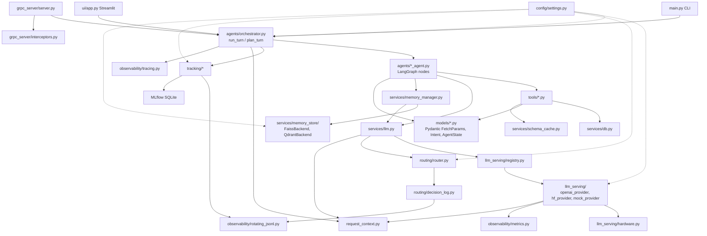
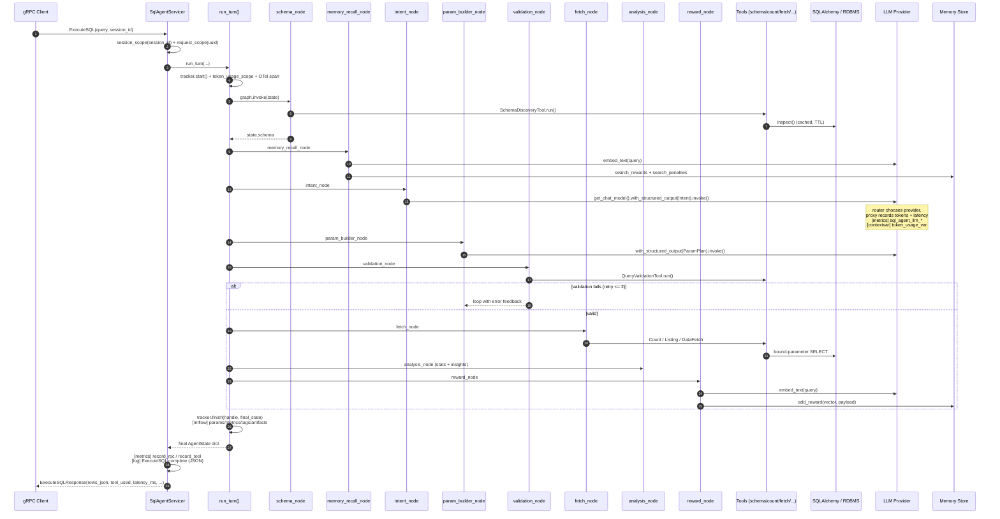
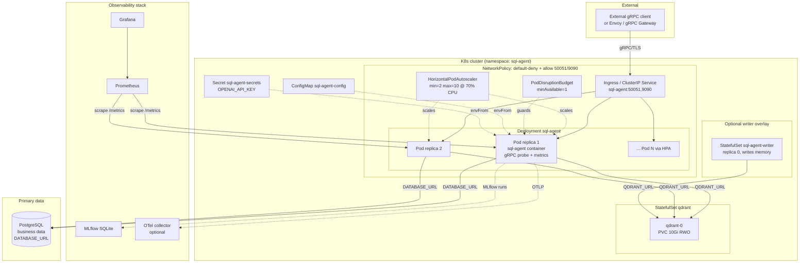

# SQL Agent — Enterprise LLM Platform for Natural-Language SQL

A production-grade, tool-driven multi-agent system that turns natural-language
business questions into safe, validated SQL queries and returns analyzed
answers — all without ever letting an LLM write raw SQL.

> **Golden rule:** the LLM emits structured Pydantic parameters; SQLAlchemy
> executes them with bound arguments. There is no text-to-SQL channel, and
> therefore no SQL-injection surface.

---

## Table of Contents

1. [At a Glance](#at-a-glance)
2. [Quick Start](#quick-start)
3. [High-Level Architecture](#high-level-architecture)
4. [LLD — Low-Level Design Workflow](#lld--low-level-design-workflow)
5. [Per-Request Lifecycle (ExecuteSQL deep-dive)](#per-request-lifecycle)
6. [Component Reference](#component-reference)
   - 6.1 [Config & Request Context](#61-config--request-context)
   - 6.2 [Models (data contracts)](#62-models-data-contracts)
   - 6.3 [Services (DB + LLM plumbing)](#63-services-db--llm-plumbing)
   - 6.4 [LLM Serving (providers)](#64-llm-serving-providers)
   - 6.5 [Tools (deterministic DB operations)](#65-tools-deterministic-db-operations)
   - 6.6 [Agents (LangGraph nodes)](#66-agents-langgraph-nodes)
   - 6.7 [Memory Store (reward / penalty)](#67-memory-store-reward--penalty)
   - 6.8 [Routing (provider selection)](#68-routing-provider-selection)
   - 6.9 [Tracking (MLflow)](#69-tracking-mlflow)
   - 6.10 [Observability (logs + metrics + traces)](#610-observability-logs--metrics--traces)
   - 6.11 [gRPC Gateway](#611-grpc-gateway)
   - 6.12 [UI + CLI (entrypoints for humans)](#612-ui--cli-entrypoints-for-humans)
7. [Configuration Reference](#configuration-reference)
8. [Deployment](#deployment)
   - 8.1 [Docker](#81-docker)
   - 8.2 [Kubernetes](#82-kubernetes)
9. [Testing](#testing)
10. [Operational Notes & Limitations](#operational-notes--limitations)
11. [Glossary](#glossary)

---

## At a Glance

| Capability | How it's delivered |
|---|---|
| **Natural-language → SQL** | LLM emits pydantic `FetchParams`; `DataFetchTool` lowers it to SQLAlchemy with bound parameters. Zero injection surface. |
| **Multi-model serving** | Pluggable `LLMProvider` Protocol. Ships with `OpenAIProvider`, `HuggingFaceProvider` (CPU/GPU), `MockProvider`. |
| **GPU → CPU fallback** | `hardware.detect_device()` auto-selects `cuda > mps > cpu`; `FORCE_CPU` / `FORCE_GPU` overrides. CPU int8 dynamic quantization as bitsandbytes-free path. |
| **Traffic routing (A/B)** | `LLMRouter` with `WeightedRandomStrategy` / `HashByIDStrategy` + circuit-breaker. SIGHUP reload. |
| **Concurrent users** | Stateless gRPC ThreadPoolExecutor server with contextvar-threaded `session_id` + `request_id`. |
| **ML lifecycle tracking** | MLflow on **SQLite** backend (not deprecated FileStore). Params, metrics, tags, artifacts per-turn. Token + cost tracking wired through provider proxies. |
| **Observability** | Structured JSON logs (session/request IDs), Prometheus histograms with per-provider latency and token counters, rotating JSONL for decision/tracking logs, optional OpenTelemetry spans. |
| **Vector memory** | `FaissBackend` (pod-local, default) or `QdrantBackend` (shared, multi-replica-safe). Swappable via `MEMORY_STORE_BACKEND`. |
| **Containerized** | 3 Dockerfiles: minimal (271 MB), local-LLM (3.0 GB), GPU. `docker-compose` with 4 profiles: default, postgres, observability, qdrant. |
| **Kubernetes-ready** | Deployment + Service + HPA(2–10, 70% CPU) + PDB + NetworkPolicy + gRPC health probes + non-root containers. Validated live on a `kind` cluster. |
| **Test coverage** | **182 tests pass by default**, **5 additional slow tests** (Qwen2.5-1.5B real-model validation, real K8s deploy on kind). |


## Quick Start

### 1. Install

Requires Python 3.11 or 3.12.

```powershell
py -3.11 -m venv .venv
.\.venv\Scripts\Activate.ps1
pip install -U pip
pip install -e .[grpc,observability,tracking,dev]   # core + gRPC + metrics + MLflow + tests
```

For local (Qwen/SmolLM) models and Qdrant memory:

```powershell
pip install -e .[all]     # adds torch + transformers + sentence-transformers + qdrant-client
```

### 2. Seed the demo database

```powershell
python -m sql_agent.seed_demo
# Seeded demo DB at sqlite:///sqlite_db/demo.db: 100 customers, 30 products, 3387 orders
```

### 3. Run it — 4 ways

**CLI (one-shot):**

```powershell
$env:OPENAI_API_KEY = "sk-..."
python -m sql_agent.main "How many orders are there in total?"
```

**Streamlit chat UI:**

```powershell
streamlit run sql_agent\ui\app.py
```

**gRPC server (local):**

```powershell
$env:LLM_PROVIDER="mock"; $env:EMBEDDING_PROVIDER="mock"
python scripts\run_grpc_server.py --port 50051
# In another terminal:
python scripts\grpc_client_demo.py --target localhost:50051 --rpc execute "count orders"
```

**Docker (default profile):**

```powershell
docker compose up -d
python scripts\grpc_client_demo.py --target localhost:50051 --rpc execute "count orders"
```

### 4. Run the tests

```powershell
pytest tests --ignore=tests/test_docker.py       # 182 default tests, ~70s
pytest tests -m slow                              # +5 slow tests (Qwen model, kind cluster)
```


## High-Level Architecture

The platform is organized as a layered pipeline. Each layer has exactly one
responsibility and communicates with adjacent layers through typed
contracts (Pydantic models, Protocols).

```
 ┌─────────────────────────────────────────────────────────────────────────┐
 │                        Clients (gRPC / HTTP / UI)                       │
 │        Streamlit UI         CLI         gRPC clients / service mesh      │
 └────────────────────────────────┬────────────────────────────────────────┘
                                  │
                   ┌──────────────▼──────────────┐
                   │  gRPC Gateway (SqlAgentServicer)             │
                   │  • TLS / bearer-auth interceptor             │
                   │  • session_scope + request_scope contextvars │
                   │  • standard grpc.health.v1.Health            │
                   └──────────────┬──────────────┘
                                  │
                  ┌───────────────▼───────────────┐
                  │     Orchestrator (LangGraph)              │
                  │     run_turn()   plan_turn()              │
                  │     OTel span + MLflow start/finish       │
                  │     token_usage_scope                     │
                  └───────────────┬───────────────┘
                                  │
    ┌─────────────────────────────┼─────────────────────────────────┐
    │                             │                                 │
    ▼                             ▼                                 ▼
┌────────────┐           ┌─────────────────┐              ┌───────────────┐
│  LLM       │           │ Deterministic   │              │ Memory Store  │
│  Serving   │           │ Tool Pipeline   │              │ (reward +     │
│            │           │                 │              │  penalty)     │
│ OpenAI /   │           │ schema discover │              │               │
│ HF / Mock  │           │ validate        │              │ FaissBackend  │
│ (Protocol) │           │ preview / fetch │              │ QdrantBackend │
│            │           │ clean / analyze │              │ (Protocol)    │
│ + Router   │           │ visualize       │              │               │
│ + Breaker  │           │                 │              │ Shared across │
│ + Metrics  │           │ SQLAlchemy      │              │ replicas with │
│ + Tokens   │           │ bound params    │              │ Qdrant        │
└─────┬──────┘           └────────┬────────┘              └───────┬───────┘
      │                           │                               │
      ▼                           ▼                               ▼
┌────────────┐           ┌─────────────────┐              ┌───────────────┐
│ OpenAI API │           │  Database       │              │ FAISS files / │
│   or       │           │  SQLite /       │              │ Qdrant server │
│ local HF   │           │  Postgres       │              │               │
└────────────┘           └─────────────────┘              └───────────────┘

                      Cross-cutting concerns (all layers):
     Structured JSON logs · Prometheus metrics · MLflow per-turn runs
                        OpenTelemetry spans (optional)
```

### Key design invariants

1. **LLM never emits SQL.** Every database interaction goes through a
   `BaseTool` subclass that ingests a Pydantic-validated input and calls
   SQLAlchemy with bound parameters.
2. **Agents are nodes in a LangGraph `StateGraph`**. They're stateless
   functions that read `AgentState` and return a delta.
3. **Everything cross-cutting uses `contextvars`** — `session_id`,
   `request_id`, `token_usage_var`. Thread-safe under the gRPC
   `ThreadPoolExecutor`, no agent modifications needed to propagate them.
4. **Providers are Protocols, not classes.** OpenAI, HF, Mock, FAISS, Qdrant
   — each satisfies a small duck-typed Protocol. Swap backends via one
   settings change; no call-site rewrites.


## LLD — Low-Level Design Workflow

This section shows **how components connect and talk to each other** inside
a single request, plus a **deployment topology** for production K8s.

### Diagram 1 — Component dependency graph

Which package imports which; read top-to-bottom, nothing ever points
"upward".



### Diagram 2 — Request flow (one `ExecuteSQL` RPC)

Full data path from client through agents, tools, and back. `[]` brackets
mark cross-cutting emissions (logs / metrics / spans / memory writes).



### Diagram 3 — Production deployment topology

How the same code runs as a real K8s workload.




## Per-Request Lifecycle

Walkthrough of a single `ExecuteSQL("How many orders?", session=abc)` call,
end to end. Timings are typical for the **mock** provider; real models add
LLM latency.

| # | Component | What happens | Key state mutations | Side effects |
|---|---|---|---|---|
| 1 | `SqlAgentServicer.ExecuteSQL` | Validates non-empty query; starts `t0` timer | `session_id`, `request_id` set via `session_scope` + `request_scope` | none |
| 2 | `orchestrator.run_turn` | Resolves `tracker = get_tracker()`, opens OTel span, opens `token_usage_scope()` | Fresh `AgentState` | **tracker.start** logs run-level params |
| 3 | `build_graph()` | Returns lru-cached `CompiledStateGraph` | none | none (already compiled at boot) |
| 4 | `schema_node` | Calls `SchemaDiscoveryTool.run()` which uses SQLAlchemy `inspect()` (cached TTL) | `state.schema` | none |
| 5 | `memory_recall_node` | `embed_text(query)` → `memory_store.search_rewards / penalties` | `state.memory_rules` | **LLM call #0** (embedding) • metrics: `sql_agent_llm_tokens_total{direction=input}` |
| 6 | `intent_node` | `get_chat_model().with_structured_output(Intent).invoke()` — router may pick provider | `state.intent` | **LLM call #1** • decision written to `routing/decisions.jsonl` if routing enabled • `sql_agent_llm_call_latency_ms{provider}` observed |
| 7 | `datetime_node` | If `intent.time_range` present: `DateTimeHandlingTool.run()` | `state.datetime_resolved` | none |
| 8 | `param_builder_node` | `with_structured_output(ParamPlan).invoke(...)` with schema + memory hints | `state.parameters`, `state.param_reasoning` | **LLM call #2** |
| 9 | `validation_node` | `QueryValidationTool.run()` — checks tables/columns/types/limits | `state.validation_errors`, `state.retry_count++` if errors | `sql_agent_validation_errors_total` if any |
| 10 | **Retry loop** (≤ `MAX_RETRIES=2`) | `validate` → `param_builder` → `validate` with error hints | retry_count bounded | **potentially LLM call #3** |
| 11 | `tool_select_node` | Maps `intent.output_type` → {count, listing, data_fetch} | `state.tool_used` | `sql_agent_tool_used_total{tool}` |
| 12 | `preview_node` | Only when `tool_used == "data_fetch"` → preview 5 rows | `state.data_preview` | DB hit |
| 13 | `fetch_node` | Runs `CountTool` / `ListingTool` / `DataFetchTool` | `state.data` | **DB SELECT** via SQLAlchemy bound params |
| 14 | `clean_node` | `DataCleaningTool.run()` (dedupe, type coerce) | `state.data_cleaned` | none |
| 15 | `analysis_node` | `StatisticalAnalysisTool.run()` | `state.analysis`, `state.insights` | none |
| 16 | `viz_node` | `VisualizationTool.run()` if `intent.visualize` | `state.visualization` (base64 PNG) | none |
| 17 | `reward_node` | `embed_text(query)` → `memory_store.add_reward(vector, payload)` | — | **memory write** (skipped if `READ_ONLY_MEMORY=true`) |
| 18 | `summarize_node` | Compresses old history if `len(messages) > 6` | `state.memory_summary` | **LLM call #4** (only when turns > 6) |
| 19 | back in `run_turn` | `tracker.finish(handle, state)` writes MLflow run with params/metrics/tags/artifacts | run marked FINISHED or FAILED | **MLflow write** • OTel span ends with attrs |
| 20 | back in `ExecuteSQL` | Assembles response proto, emits final log + RPC metrics | — | structured JSON log line • `sql_agent_rpc_total{status}` • `sql_agent_rpc_latency_ms_bucket` |

Happy-path cost: **2 LLM calls** (intent + param_builder), one DB SELECT,
one FAISS/Qdrant read + one write. `GenerateSQL` (`plan_turn`) uses the
**plan-only subgraph** — same flow through step 11, then jumps straight
to END, skipping steps 12-16 (no DB read, no analysis, no memory write).


## Component Reference

Every package in `sql_agent/` documented with **what it does**, **who
depends on it**, and **key functions/classes**. Read top-to-bottom —
each subsection builds on the previous.

### 6.1 Config & Request Context

Central settings + contextvars for per-request identity.

| File | Key names | Purpose |
|---|---|---|
| `sql_agent/config/settings.py` | `Settings` (pydantic) + `settings` singleton | Single source of truth for every env var. ~50 fields across 9 phases; all have safe defaults. Never raises on missing env — produces a working demo out-of-the-box. |
| `sql_agent/config/logging.py` | `configure_logging()`, `get_logger(name)` | Idempotent root-logger setup. Switches to JSON + ContextFilter when `LOG_JSON=true`. |
| `sql_agent/request_context.py` | `session_id_var`, `request_id_var`, `token_usage_var` (ContextVars); `session_scope`, `request_scope`, `token_usage_scope` (contextmanagers); `record_token_usage(provider, model, input, output)` | Thread-safe, asyncio-safe per-request state. gRPC servicer binds session/request id at the RPC boundary; providers push token usage into the accumulator; the tracker reads it at turn end. |

**Why ContextVars (not function args)?** Propagating `session_id` through
every agent and tool would require changing hundreds of signatures. A
ContextVar flows transparently through any call stack on the same
thread/task and is zeroed at scope exit — zero invasive edits.


### 6.2 Models (data contracts)

Pure Pydantic schemas. No runtime behavior; they ARE the public API
between agents, tools, and the LLM.

| File | Key names | Purpose |
|---|---|---|
| `sql_agent/models/tool_schemas.py` | `FetchParams`, `FilterCondition`, `JoinSpec`, `AggregationSpec`, `OrderBySpec`, `TimeGrouping`, `SchemaInfo`, `ColumnSchema`, `TableSchema` | The query-shape the LLM produces. `FetchParams` has table names, columns, filters, joins, aggregations, group_by, time_grouping, order_by, limit. `DataFetchTool` lowers it to SQLAlchemy. |
| `sql_agent/models/intent.py` | `Intent`, `IntentTimeRange`, `IntentFilter`, `OutputType` enum | The lighter high-level parse of the user's question — metrics + dimensions + output-type hint. `intent_agent` produces it; `param_builder_agent` consumes it. |
| `sql_agent/models/graph_state.py` | `AgentState` TypedDict, `ChatMessage`, `MemoryRule` | The state dict that flows through every LangGraph node. Each node reads the keys it needs and returns a **delta** (partial dict); LangGraph merges. |

The contract is enforced **twice** — once by pydantic when the LLM
produces structured output, again by `QueryValidationTool` which
cross-references against the discovered `SchemaInfo` before the DB is
touched.


### 6.3 Services (DB + LLM plumbing)

Thin adapters that agents and tools depend on.

| File | Key names | Purpose |
|---|---|---|
| `sql_agent/services/db.py` | `get_engine()`, `reset_engine()` | Cached SQLAlchemy `Engine` honoring `DATABASE_URL`. Supports SQLite and Postgres. `pool_pre_ping=True` so dead connections are detected before use. |
| `sql_agent/services/llm.py` | `get_chat_model(temperature)`, `embed_text(text)`, `embed_texts(texts)`, `_route_provider_name()` | Public LLM API agents call. Delegates to the registry; consults router when `LLM_ROUTING_ENABLED=true`; reports provider success/failure into the circuit breaker. Byte-compatible with pre-phase-2 imports. |
| `sql_agent/services/schema_cache.py` | `SchemaCache`, `schema_cache` singleton | Thread-safe TTL cache keyed by `engine.url`, so schema reflection doesn't run on every turn. |
| `sql_agent/services/memory_manager.py` | `MemoryManager`, `get_memory_manager()`, `reset_memory_manager()` | Public API for reward/penalty memory. Phase 9 delegates to a `MemoryStore` backend (FAISS or Qdrant). Respects `READ_ONLY_MEMORY` to suppress writes on replicas. |
| `sql_agent/services/memory_store/` | `base.MemoryStore` Protocol, `faiss_backend.FaissBackend`, `qdrant_backend.QdrantBackend`, `factory.build_memory_store` | Pluggable backends. FAISS is pod-local (single-replica); Qdrant is shared (multi-replica-safe). Factory picks by `MEMORY_STORE_BACKEND` setting. |


### 6.4 LLM Serving (providers)

Protocol-based provider layer. Agents never know which provider they're
talking to.

| File | Key names | Purpose |
|---|---|---|
| `sql_agent/llm_serving/base.py` | `ChatModel`, `StructuredInvoker`, `LLMProvider`, `EmbeddingProvider` Protocols; `ProviderUnavailableError` | The minimum duck-typed surface agents use: `.with_structured_output(cls).invoke(msgs)` and `.invoke(msgs).content`. Any class matching this shape can be a provider. |
| `sql_agent/llm_serving/hardware.py` | `detect_device()`, `log_execution_mode(device, model_id)`, `torch_available()` | CUDA > MPS > CPU auto-detection with `FORCE_CPU` / `FORCE_GPU` overrides. Lazy torch import — importing this module never forces torch. |
| `sql_agent/llm_serving/openai_provider.py` | `OpenAIProvider`, `_ChatOpenAIProxy`, `_StructuredInvokerProxy` | Wraps `langchain_openai.ChatOpenAI` in a proxy that reports token usage + latency on every call (Phase 8.6). `include_raw=True` exposes `AIMessage.usage_metadata` even for structured-output calls. |
| `sql_agent/llm_serving/openai_embedder.py` | `OpenAIEmbedder` | `text-embedding-3-small` (1536-dim) by default. Static dim lookup avoids a blocking roundtrip just to discover shape. |
| `sql_agent/llm_serving/hf_provider.py` | `HuggingFaceProvider`, `_HFChatModel`, `_HFStructuredInvoker` | Local `transformers` model. JSON-schema prompting + pydantic parse + 1 retry for structured output. Supports `int8_dynamic` quantization (CPU-portable), plus bitsandbytes 4bit/8bit (Linux). Emits per-call latency + token count metrics (Phase 8.6). |
| `sql_agent/llm_serving/hf_embedder.py` | `HuggingFaceEmbedder` | `sentence-transformers` wrapper (default: `all-MiniLM-L6-v2`, 384-dim). |
| `sql_agent/llm_serving/mock_provider.py` | `MockProvider` + registration API | Deterministic fake used by tests and `LLM_PROVIDER=mock` demos. Has built-in factories for `Intent` and `ParamPlan` so compose-up works with zero config. |
| `sql_agent/llm_serving/mock_embedder.py` | `MockEmbedder` | SHA-256-derived deterministic vectors. Default dim 64; configurable. |
| `sql_agent/llm_serving/registry.py` | `get_llm_provider(name)`, `get_embedding_provider(name)`, `reset_caches()` | Process-wide cache. `name=None` means "read `settings.llm_provider`". Lazy imports — Qdrant / torch only loaded if you actually ask for them. |

Provider resolution is **data-driven**: `get_chat_model()` never sees a
class name in its caller's code.


### 6.5 Tools (deterministic DB operations)

Every database interaction flows through a `BaseTool` subclass. Tools
have Pydantic input and output schemas; no free-form SQL anywhere.

| File | Key classes | Responsibility |
|---|---|---|
| `sql_agent/tools/base.py` | `BaseTool[InputT, OutputT]`, `ToolExecutionError` | Abstract base. `run(payload)` validates input against `input_schema`, calls `_execute()`, validates output. Predictable user-facing errors raise `ToolExecutionError`; bugs raise anything else. |
| `sql_agent/tools/schema_discovery.py` | `SchemaDiscoveryTool` | Reflects DB schema via SQLAlchemy `inspect()`. Returns typed `SchemaInfo`. Results cached per `engine.url` with TTL. |
| `sql_agent/tools/table_relationship.py` | `TableRelationshipTool` | Derives FK edges and shortest join path for a requested set of tables. Used by `DataFetchTool` when the LLM requests multiple tables without explicit join specs. |
| `sql_agent/tools/query_validation.py` | `QueryValidationTool` | Cross-checks `FetchParams` against `SchemaInfo`: tables/columns exist, aggregation columns are numeric, filter ops match types, limits within bounds. Emits warnings for full-scans. |
| `sql_agent/tools/data_fetch.py` | `DataFetchTool` | The heart of the SQL-safety story. Lowers `FetchParams` → SQLAlchemy `Select` with bound params. Handles joins (explicit + auto-derived), aggregations, time bucketing (dialect-aware: `strftime` on SQLite, `date_trunc` on Postgres), order-by by select-alias. |
| `sql_agent/tools/count_tool.py` | `CountTool` | Optimized `SELECT COUNT(*)` with filters. Separate from DataFetchTool because counts short-circuit result-size concerns. |
| `sql_agent/tools/listing_tool.py` | `ListingTool` | `SELECT DISTINCT` with filters. Used for "list unique customers" type asks. |
| `sql_agent/tools/data_preview.py` | `DataPreviewTool` | 5-row preview before a full fetch — catches obvious issues (wrong column, wrong filter type) without pulling millions of rows. |
| `sql_agent/tools/data_cleaning.py` | `DataCleaningTool` | Dedup, null handling, numeric coercion, datetime normalization. |
| `sql_agent/tools/datetime_handling.py` | `DateTimeHandlingTool` | Parses natural-language time expressions ("last 6 months", "January 2024") into concrete start/end dates. |
| `sql_agent/tools/statistical_analysis.py` | `StatisticalAnalysisTool` | Descriptive stats, correlations, grouped summaries, insight strings. |
| `sql_agent/tools/visualization.py` | `VisualizationTool` | matplotlib → base64 PNG; chart kind inferred from intent. |

**Injection-safety invariant:** every `FetchParams` field is validated
by Pydantic (no semicolons, no SQL comment markers) AND by
`QueryValidationTool`. SQLAlchemy's expression language binds values
with parameters — there is no string concatenation anywhere in the
DB pipeline.


### 6.6 Agents (LangGraph nodes)

Each agent is a **pure function** `AgentState → AgentState delta`.
No instance state; they pick up configuration from the `state` dict and
the shared services. This is what makes them trivially thread-safe.

| File | Node function | Inputs read | Outputs written | External calls |
|---|---|---|---|---|
| `sql_agent/agents/schema_agent.py` | `schema_node` | `—` (first node) | `state.schema` | `SchemaDiscoveryTool` |
| `sql_agent/agents/memory_agent.py` | `memory_recall_node`, `reward_node`, `penalty_node`, `summarize_node` + `format_rules_for_prompt()` | `user_query`, `parameters`, `tool_used`, `error`, `messages` | `memory_rules`, `memory_summary`, `success` | `MemoryManager`, `get_chat_model()` for summarize |
| `sql_agent/agents/intent_agent.py` | `intent_node` | `user_query`, `schema`, `memory_summary` | `intent` | `get_chat_model().with_structured_output(Intent)` |
| `sql_agent/agents/datetime_agent.py` | `datetime_node` | `intent.time_range` | `datetime_resolved` | `DateTimeHandlingTool` |
| `sql_agent/agents/param_builder_agent.py` | `param_builder_node`; defines `ParamPlan` class | `schema`, `intent`, `datetime_resolved`, `memory_rules`, `validation_errors` | `parameters`, `param_reasoning` | `get_chat_model().with_structured_output(ParamPlan)` |
| `sql_agent/agents/validation_agent.py` | `validation_node`, `validation_router` | `parameters`, `schema` | `validation_errors`, `retry_count` | `QueryValidationTool` |
| `sql_agent/agents/tool_selection_agent.py` | `tool_selection_node` | `intent.output_type` | `tool_used` | none (deterministic) |
| `sql_agent/agents/data_agent.py` | `preview_node`, `fetch_node`, `clean_node` | `tool_used`, `parameters`, `schema` | `data_preview`, `data`, `data_cleaned` | `CountTool` / `ListingTool` / `DataFetchTool` / `DataCleaningTool` |
| `sql_agent/agents/analysis_agent.py` | `analysis_node` | `data_cleaned`, `parameters` | `analysis`, `insights` | `StatisticalAnalysisTool` |
| `sql_agent/agents/visualization_agent.py` | `viz_node` | `intent.visualize`, `data_cleaned`, `parameters` | `visualization` (base64 PNG) | `VisualizationTool` |
| `sql_agent/agents/orchestrator.py` | `build_graph()`, `build_plan_graph()`, `run_turn(...)`, `plan_turn(...)` | — | compiled `CompiledStateGraph` (lru_cached); public entry points | wires everything above; wraps each call in `token_usage_scope` + `tracker.start/finish` + OTel span |

**`run_turn` vs `plan_turn`:**
- `run_turn` runs the full pipeline (schema → ... → reward → summarize).
  Used by CLI, Streamlit UI, and the gRPC `ExecuteSQL` RPC.
- `plan_turn` stops at `tool_select` — produces the plan (tool + params +
  reasoning) without hitting the DB, running analysis, or writing to
  memory. Used by the gRPC `GenerateSQL` RPC. ~2x faster.


### 6.7 Memory Store (reward / penalty)

Dual-layer vector memory. The `MemoryManager` is a thin coordinator; the
actual storage is a pluggable backend.

| File | Key names | Purpose |
|---|---|---|
| `sql_agent/services/memory_manager.py` | `MemoryManager`, `get_memory_manager`, `reset_memory_manager`, `_probe_embedding_dim()`, `_LEGACY_DIM` | Public API: `record_reward`, `record_penalty`, `recall`. Probes embedding dim from registry at construction; refuses to write when `READ_ONLY_MEMORY=true`. |
| `sql_agent/services/memory_store/base.py` | `MemoryStore` Protocol | Backend contract: `add_reward`, `add_penalty`, `search_rewards`, `search_penalties`, `reward_size`, `penalty_size`. |
| `sql_agent/services/memory_store/faiss_backend.py` | `FaissBackend`, `_FaissIndex`, `_migrate_legacy_indices` | Default. Filesystem-local `IndexFlatIP` with JSONL sidecar for payloads. Dim-namespaced directories (`dim1536/`, `dim384/`...) so you can switch embedders without corrupting old indices. **Pod-local — divergent under multi-replica.** |
| `sql_agent/services/memory_store/qdrant_backend.py` | `QdrantBackend` | **Production-grade** shared vector DB. Two modes: embedded (local path) and remote (`QDRANT_URL`). Multi-replica-safe — all pods see the same memory. |
| `sql_agent/services/memory_store/factory.py` | `build_memory_store(dimension, root_dir)` | Reads `MEMORY_STORE_BACKEND` setting; `auto` mode picks Qdrant when `QDRANT_URL` is set, else FAISS. |

**Recommended topology for production K8s:**
- `MEMORY_STORE_BACKEND=qdrant`
- Deploy `deploy/k8s/qdrant.yaml` (StatefulSet + Service)
- Point all sql-agent pods at `http://qdrant:6333`
- No need for `READ_ONLY_MEMORY` or the writer-pod StatefulSet pattern.


### 6.8 Routing (provider selection)

Picks which LLM provider serves each call. Opt-in — off by default.

| File | Key names | Purpose |
|---|---|---|
| `sql_agent/routing/base.py` | `RoutingStrategy` Protocol, `RoutingDecision` dataclass | Strategy contract: `choose(session_id) -> provider_name`. `RoutingDecision` is what's written to the audit log per call. |
| `sql_agent/routing/weighted.py` | `WeightedRandomStrategy` + `from_env_string()` | Parses `"openai:70, hf:30"` into weighted choice. Good for pure A/B experiments. |
| `sql_agent/routing/deterministic.py` | `HashByIDStrategy` | `hash(session_id) % total_weight`. Same session always routes to the same provider — useful for multi-turn conversations where consistency matters. |
| `sql_agent/routing/circuit_breaker.py` | `CircuitBreakingStrategy` | Wraps any strategy with per-provider failure tracking. After `LLM_ROUTING_BREAKER_THRESHOLD` consecutive failures, opens the circuit for `LLM_ROUTING_BREAKER_COOLDOWN_SECONDS`. Transitions CLOSED → OPEN → HALF_OPEN → CLOSED. |
| `sql_agent/routing/decision_log.py` | `DecisionLogWriter` | Thread-safe JSONL append. Backed by `RotatingJsonlWriter` (size-based rotation). One line per routing decision. |
| `sql_agent/routing/router.py` | `LLMRouter`, `get_router()`, `reset_router()`, `reload_router()`, `install_sighup_reload_handler()` | Public API. Routing failures never propagate — any exception falls back to `settings.llm_provider`. POSIX SIGHUP triggers `reload_router()` for live config reload. |

**Circuit breaker integration:** `services/llm.py::get_chat_model`
wraps the provider construction in a try/except and calls
`router.report_failure(provider_name)` on any error.
`router.report_success` is called on successful construction. All
best-effort — routing feedback never blocks the pipeline.


### 6.9 Tracking (MLflow)

Per-turn experiment tracking. Every `run_turn` produces one MLflow run
with params, metrics, tags, and artifacts.

| File | Key names | Purpose |
|---|---|---|
| `sql_agent/tracking/base.py` | `TurnTracker`, `TurnHandle` Protocols; `summarize_state(state, user_query, session_id, query_max_chars)` | Shared helper that normalizes an `AgentState` dict into `{params, metrics, tags, artifacts}` — reused by every concrete tracker. |
| `sql_agent/tracking/noop_tracker.py` | `NoOpTracker` | Zero-overhead default. Returned when `TRACKING_ENABLED=false`. |
| `sql_agent/tracking/file_tracker.py` | `FileTracker` | JSONL-backed. No external deps. Rotated via `RotatingJsonlWriter`. Good for lightweight environments where an MLflow server is overkill. |
| `sql_agent/tracking/mlflow_tracker.py` | `MLflowTracker` | Real MLflow. Uses `MlflowClient` with explicit `run_id` everywhere (avoids `mlflow.start_run`'s thread-local active-run state). **Default URI is `sqlite:///logs/tracking/mlflow.db`** (FileStore was deprecated in Feb 2026). |
| `sql_agent/tracking/registry.py` | `get_tracker()`, `reset_tracker()` | Reads `TRACKING_BACKEND` (`noop` / `file` / `mlflow` / `auto`). `auto` tries MLflow first, falls back to file, falls back to noop. |

**What's captured per run:**

| Field | Source |
|---|---|
| **Params** (categorical/text) | `user_query`, `session_id`, `llm_provider`, `llm_model_id`, `llm_device`, `embedding_provider`, `embedding_model_id`, `embedding_dim`, `routing_enabled`, `routing_weights` |
| **Metrics** (numeric) | `latency_ms`, `row_count`, `retry_count`, `validation_error_count`, `insights_word_count`, `success` (0/1), `invalid_sql_rate_proxy` (0/1), `input_tokens`, `output_tokens`, `total_tokens` |
| **Tags** | `tool_used`, `error_type` (bucketed: `validation_error`, `schema_error`, `fetch_error`, `intent_error`, `param_builder_error`, `analysis_error`, `exception`, …) |
| **Artifacts** | `parameters.json` (the LLM-produced FetchParams), `data_head.json` (first 20 rows), `error.txt` (full error) |

**Token tracking** is populated by the provider proxies (phase 8.3/8.6):
every LLM call writes into `token_usage_var`; `summarize_state` reads
the accumulator at turn end.


### 6.10 Observability (logs + metrics + traces)

Three pillars, all opt-in.

| File | Key names | Purpose |
|---|---|---|
| `sql_agent/observability/structured_logging.py` | `ContextFilter`, `JsonFormatter`, `apply_json_logging()` | `ContextFilter` injects `session_id` + `request_id` from contextvars into every `LogRecord`. `JsonFormatter` emits one JSON object per line, promoting any `extra={}` fields to top-level keys. Activated by `LOG_JSON=true`. |
| `sql_agent/observability/metrics.py` | `Metrics` class, `get_metrics()`, `reset_metrics(registry)`, `start_metrics_server(port, addr, registry)`, `stop_metrics_server()` | Prometheus-client wrappers. Each `Metrics` owns its own `CollectorRegistry` (so tests don't collide). Exposes `/metrics` over HTTP via a daemon thread when `METRICS_ENABLED=true`. |
| `sql_agent/observability/tracing.py` | `get_tracer()`, `reset_tracer()` | Optional OpenTelemetry. Returns a no-op tracer when disabled, so call sites always work with `with tracer.start_as_current_span(...)`. Honors standard `OTEL_*` env vars (`OTEL_EXPORTER_OTLP_ENDPOINT`, etc.). |
| `sql_agent/observability/rotating_jsonl.py` | `RotatingJsonlWriter` | Shared size-based rotation used by both routing's `DecisionLogWriter` and tracking's `FileTracker`. Default 50 MB × 5 backups. |

**Prometheus metrics exposed:**

| Metric | Labels | Emitted by |
|---|---|---|
| `sql_agent_rpc_total` | `rpc`, `status` | gRPC servicer on each RPC |
| `sql_agent_rpc_latency_ms` (histogram) | `rpc` | gRPC servicer |
| `sql_agent_tool_used_total` | `tool` | gRPC servicer, from final state |
| `sql_agent_validation_errors_total` | — | gRPC servicer |
| `sql_agent_llm_provider_total` | `provider` | `LLMRouter.route()` |
| `sql_agent_llm_call_latency_ms` (histogram) | `provider`, `model` | provider proxies (OpenAI + HF) |
| `sql_agent_llm_tokens_total` | `provider`, `model`, `direction` | provider proxies |
| `sql_agent_memory_writes_total` | `kind` | MemoryManager (not wired in every backend yet) |


### 6.11 gRPC Gateway

Wraps `run_turn` / `plan_turn` over gRPC with health probes + optional
auth + optional TLS.

| File | Key names | Purpose |
|---|---|---|
| `sql_agent/grpc_server/sql_agent.proto` | `SqlAgent` service: `GenerateSQL`, `ExecuteSQL`, `HealthCheck` | Wire contract. Messages carry session_id, prior_messages, memory_summary. |
| `sql_agent/grpc_server/sql_agent_pb2.py`, `sql_agent_pb2_grpc.py` | — | Generated protobuf bindings. Regenerate via `python -m grpc_tools.protoc -I sql_agent/grpc_server --python_out=sql_agent/grpc_server --grpc_python_out=sql_agent/grpc_server sql_agent/grpc_server/sql_agent.proto` (then patch the generated `_grpc.py` to use relative imports). |
| `sql_agent/grpc_server/server.py` | `SqlAgentServicer`, `create_server(port, max_workers)`, `serve(port, max_workers)`, `_record_rpc_metrics`, `_record_turn_metrics` | The implementation. Also registers the **standard `grpc.health.v1.Health` service** so `grpc_health_probe` and K8s gRPC probes work out-of-the-box. Installs SIGHUP handler for live routing reload. Boots the Prometheus exposer if enabled. |
| `sql_agent/grpc_server/interceptors.py` | `BearerAuthInterceptor` | Per-RPC `authorization: Bearer <token>` enforcement. Health-check methods are allowlisted so kube-probes always succeed. |

**Two RPCs, two costs:**
- `GenerateSQL` → `plan_turn` → no DB hit, no memory write, ~½ the latency.
- `ExecuteSQL` → `run_turn` → full pipeline including data + analysis.

Each RPC's body is wrapped:

```python
with session_scope(session_id), request_scope() as request_id:
    # ... call run_turn / plan_turn ...
```

which binds the contextvars for the duration of this RPC only, on this
thread only. Downstream services (routing, logging, tracing, tracking)
pick them up automatically.


### 6.12 UI + CLI (entrypoints for humans)

Both are thin wrappers over `run_turn`. They exist so the same pipeline
is reachable without spinning up gRPC.

| File | Purpose |
|---|---|
| `sql_agent/main.py` | CLI: `python -m sql_agent.main "<question>"`. Auto-seeds the demo DB (unless `--skip-seed`). Prints tool, parameters, rows, insights. |
| `sql_agent/ui/app.py` | Streamlit chat interface. Session list in the sidebar, per-session chat history persisted to JSON under `sqlite_db/chat_histories/`. Renders pandas DataFrames + base64 charts from the final state. |
| `sql_agent/ui/chat_history.py` | `ChatHistoryStore` — CRUD over per-session JSON files. |
| `sql_agent/ui/sidebar.py` | Streamlit sidebar: session switcher + new-chat button + delete. |
| `sql_agent/seed_demo.py` | `seed(force=False)` — creates `customers`, `products`, `orders` tables in the configured DB with ~3400 synthetic orders. Idempotent by default. |

**Scripts:**

| File | Purpose |
|---|---|
| `scripts/run_grpc_server.py` | Launch the gRPC gateway. `--mock-llm` flips `LLM_PROVIDER=mock` for zero-setup demos. Respects `SEED_DEMO_ON_BOOT`. |
| `scripts/grpc_client_demo.py` | Canonical client: `--rpc execute|generate|health`, `--session-id`, `--target`. |
| `scripts/render_k8s.py` | Concatenates manifests from `deploy/k8s/kustomization.yaml` for local inspection. `--kubectl` pipes through `kubectl apply --dry-run=client`. |
| `scripts/pin_base_digests.py` | CI helper that rewrites each Dockerfile's `ARG *_IMAGE=` line to include the base image's current sha256 digest. |
| `scripts/generate_sbom.py` | Wraps `docker sbom` to emit CycloneDX/SPDX SBOM artifacts per image. |


## Configuration Reference

Every setting has a safe default; set only what you need to override.
Source of truth: `sql_agent/config/settings.py`; example in
`sql_agent/.env.example`.

### Core

| Variable | Default | What it does |
|---|---|---|
| `OPENAI_API_KEY` | empty | Required only when `LLM_PROVIDER=openai` (default). |
| `OPENAI_CHAT_MODEL` | `gpt-4o-mini` | OpenAI chat model name. |
| `OPENAI_EMBEDDING_MODEL` | `text-embedding-3-small` | OpenAI embedding model (1536-dim). |
| `DATABASE_URL` | `sqlite:///sqlite_db/demo.db` | SQLAlchemy URL. Supports SQLite + Postgres. |
| `LOG_LEVEL` | `INFO` | Root logger level. |
| `FAISS_INDEX_DIR` | `sqlite_db/faiss_index` | Where FAISS backend stores indices. |
| `SEED_DEMO_ON_BOOT` | `false` | If true, gRPC server seeds the demo DB on startup. |

### LLM serving

| Variable | Default | What it does |
|---|---|---|
| `LLM_PROVIDER` | `openai` | `openai` / `hf` / `mock`. |
| `EMBEDDING_PROVIDER` | `auto` | `auto` follows `LLM_PROVIDER`; else `openai` / `hf` / `mock`. |
| `FORCE_CPU`, `FORCE_GPU` | `false` | Override device autodetect. |
| `HF_CHAT_MODEL` | `Qwen/Qwen2.5-1.5B-Instruct` | Local HF model ID. |
| `HF_EMBEDDING_MODEL` | `sentence-transformers/all-MiniLM-L6-v2` | Local embedding model. |
| `HF_QUANTIZATION` | `none` | `none` / `int8_dynamic` (CPU-portable) / `4bit` / `8bit` (bitsandbytes, Linux). |
| `HF_MAX_NEW_TOKENS` | `512` | Generation cap. |
| `HF_CACHE_DIR` | empty → default HF cache | Override model download location. |

### gRPC + auth

| Variable | Default | What it does |
|---|---|---|
| `GRPC_PORT` | `50051` | Bind port. |
| `GRPC_TLS_CERT_FILE`, `GRPC_TLS_KEY_FILE` | empty | Both set → TLS; else insecure. |
| `GRPC_AUTH_TOKEN` | empty | Non-empty → interceptor enforces `authorization: Bearer <token>`; health service always exempt. |

### Routing

| Variable | Default | What it does |
|---|---|---|
| `LLM_ROUTING_ENABLED` | `false` | Master switch. |
| `LLM_ROUTING_STRATEGY` | `weighted` | `weighted` / `hash_by_id`. |
| `LLM_ROUTING_WEIGHTS` | `openai:100` | `"openai:70, hf:30"` form. |
| `LLM_ROUTING_DECISION_LOG` | `logs/routing/decisions.jsonl` | JSONL audit log path. |
| `LLM_ROUTING_CIRCUIT_BREAKER` | `false` | Wrap strategy with per-provider failure tracking. |
| `LLM_ROUTING_BREAKER_THRESHOLD` | `3` | Consecutive failures to open the circuit. |
| `LLM_ROUTING_BREAKER_COOLDOWN_SECONDS` | `30` | Open → half-open transition wait. |

### Tracking (MLflow)

| Variable | Default | What it does |
|---|---|---|
| `TRACKING_ENABLED` | `false` | Master switch. |
| `TRACKING_BACKEND` | `auto` | `auto` / `mlflow` / `file` / `noop`. |
| `MLFLOW_TRACKING_URI` | empty → `sqlite:///logs/tracking/mlflow.db` | MLflow DB. |
| `MLFLOW_EXPERIMENT_NAME` | `sql_agent` | Experiment to group runs. |
| `TRACKING_FILE_LOG` | `logs/tracking/turns.jsonl` | File-tracker output. |
| `TRACKING_QUERY_MAX_CHARS` | `500` | Truncate stored `user_query`. |

### Observability

| Variable | Default | What it does |
|---|---|---|
| `LOG_JSON` | `false` | Switch root-logger to `JsonFormatter`. |
| `METRICS_ENABLED` | `false` | Boot Prometheus `/metrics` server. |
| `METRICS_PORT` | `9090` | Exposer port. |
| `METRICS_ADDR` | empty → all interfaces | Bind address. |
| `LOG_ROTATION_MAX_BYTES` | `52428800` (50 MB) | Per-file rotation threshold. |
| `LOG_ROTATION_BACKUP_COUNT` | `5` | Number of `.1..N` backups kept. |
| `OTEL_ENABLED` | `false` | Enable OpenTelemetry tracing. |
| `OTEL_SERVICE_NAME` | `sql-agent` | OTel `service.name` resource. |

### Memory store

| Variable | Default | What it does |
|---|---|---|
| `READ_ONLY_MEMORY` | `false` | Suppress reward/penalty writes on this pod. |
| `MEMORY_STORE_BACKEND` | `faiss` | `faiss` / `qdrant` / `auto` (qdrant iff `QDRANT_URL` set). |
| `QDRANT_URL` | empty → embedded | e.g. `http://qdrant:6333`. |
| `QDRANT_API_KEY` | empty | For Qdrant Cloud. |
| `QDRANT_COLLECTION_PREFIX` | `sql_agent_` | Prefix for `reward` / `penalty` collections. |


## Deployment

### 8.1 Docker

Three Dockerfiles, each a multi-stage build with a non-root `sql_agent`
user (UID 10001), gRPC-native `HEALTHCHECK` via `grpc_health_probe`, and
`--chown` COPY to avoid duplicate layers.

| File | Size (built) | Contents | When to use |
|---|---|---|---|
| `Dockerfile` | **271 MB** | Core + gRPC + observability + tracking (no torch) | OpenAI or Mock provider; most production deployments |
| `Dockerfile.local-llm` | **3.0 GB** | Above + torch CPU + transformers + sentence-transformers | Offline / on-prem / CPU-only HF local models |
| `Dockerfile.gpu` | ~6 GB | CUDA 12.4 runtime + torch GPU + full stack | GPU hosts (needs NVIDIA container toolkit) |

**Compose profiles** (in `docker-compose.yml`):

| Profile | Services | Example |
|---|---|---|
| `default` (always) | `sql-agent` (SQLite volume) | `docker compose up` |
| `postgres` | + `postgres`, + `sql-agent-pg` with `DATABASE_URL` override | `docker compose --profile postgres up` |
| `observability` | + `prometheus`, + `grafana` | `docker compose --profile observability up` |
| `qdrant` | + `qdrant`, + `sql-agent-qdrant` with `MEMORY_STORE_BACKEND=qdrant` | `docker compose --profile qdrant up` |

Combinable: `docker compose --profile postgres --profile observability --profile qdrant up`.

**Release workflow (CI):**

```bash
# 1. Pin base-image digests for reproducibility
python scripts/pin_base_digests.py

# 2. Build and tag
docker build -t your-registry/sql-agent:v0.2.0 .

# 3. Generate SBOM
python scripts/generate_sbom.py --image your-registry/sql-agent:v0.2.0

# 4. Push
docker push your-registry/sql-agent:v0.2.0
```


### 8.2 Kubernetes

Manifests under `deploy/k8s/`, orchestrated via kustomize.

| File | Purpose |
|---|---|
| `namespace.yaml` | `sql-agent` namespace |
| `configmap.yaml` | All non-secret config (one place to tune production behavior) |
| `secret.example.yaml` | Template; real secret created via `kubectl create secret generic sql-agent-secrets --from-literal=OPENAI_API_KEY=...` |
| `deployment.yaml` | 2 replicas minimum, gRPC liveness + readiness, resource requests/limits, anti-affinity, `emptyDir` volumes, non-root (UID 10001), seccomp runtime-default, read-only-root-fs capable, `cap_drop=ALL` |
| `service.yaml` | ClusterIP exposing 50051 (gRPC) + 9090 (metrics), headless variant for StatefulSet addressing |
| `hpa.yaml` | HorizontalPodAutoscaler, min=2 max=10 targetCPU=70%, conservative scale-down (300s window) / fast scale-up (30s) |
| `poddisruptionbudget.yaml` | minAvailable=1 — voluntary disruptions can't break service |
| `networkpolicy.yaml` | default-deny inbound + allow gRPC/metrics from same namespace or `monitoring` ns |
| `servicemonitor.yaml` | Prometheus Operator CRD (opt-in) |
| `qdrant.yaml` | **Phase 9** — StatefulSet + Service for shared vector memory (eliminates multi-replica FAISS divergence) |
| `statefulset-writer.yaml` | **Legacy** workaround for FAISS multi-replica; obsoleted by `qdrant.yaml` in modern deployments |
| `kustomization.yaml` | Base layer; users create overlays for per-env patches |

**Deployment walkthrough:**

```bash
# Kind (local) — or any real cluster
kind create cluster --name sql-agent
docker build -t sql-agent:latest .
kind load docker-image sql-agent:latest --name sql-agent

# Apply base (Deployment, Service, HPA, PDB, NetworkPolicy, ConfigMap)
kubectl apply -k deploy/k8s/

# Add Qdrant for production-grade shared memory
kubectl apply -f deploy/k8s/qdrant.yaml
kubectl -n sql-agent patch configmap sql-agent-config --type merge \
  -p '{"data":{"MEMORY_STORE_BACKEND":"qdrant","QDRANT_URL":"http://qdrant:6333"}}'
kubectl -n sql-agent rollout restart deployment/sql-agent

# Verify
kubectl -n sql-agent wait --for=condition=Ready pod -l app.kubernetes.io/name=sql-agent --timeout=120s
kubectl -n sql-agent port-forward svc/sql-agent 50051:50051 9090:9090
grpc_health_probe -addr=localhost:50051    # → status: SERVING
curl http://localhost:9090/metrics | head
```

**Validated live** on a kind cluster: 2 pods Ready, Service routing to
them, `ExecuteSQL` returns `count=3387`, rolling restart respects the
PodDisruptionBudget (1 pod always available).


## Testing

**182 tests pass by default; 5 additional `@slow` tests** exercise real
model downloads and a real kind cluster.

```powershell
# Default: skips @slow (Qwen2.5-1.5B model, kind cluster)
pytest tests --ignore=tests/test_docker.py              # ~70s

# Include slow tests (adds ~6 GB of downloads + ~2 min kind cluster)
pytest tests -m slow

# Everything, including Docker build/smoke
pytest tests
```

### Test files and what they prove

| File | What's covered |
|---|---|
| `tests/conftest.py` | Session-scoped tmp DB, FAISS dir isolation, `fake_llm` fixture (deterministic structured-output), pre-import of agent modules to prevent monkeypatch leaks |
| `tests/test_grpc_smoke.py` | gRPC gateway surface: Health, GenerateSQL, ExecuteSQL, invalid-input rejection, session id echo |
| `tests/test_llm_serving.py` | Provider Protocol conformance, hardware detection (with + without torch), Mock behavior, registry caching |
| `tests/test_provider_integration.py` | End-to-end `run_turn` with `LLM_PROVIDER=mock`; OpenAI path unchanged; gRPC path |
| `tests/test_hf_provider.py` | JSON extraction / parsing / retry; SmolLM2-135M real-model load + generate |
| `tests/test_embedding_and_memory.py` | Mock + HF embedders, dim-namespaced FAISS, legacy migration, switching dims between managers |
| `tests/test_memory_store.py` | **Phase 9** — FAISS + Qdrant protocol conformance, backend-agnostic read/write/search, persistence across re-init, factory rules |
| `tests/test_routing.py` | WeightedRandomStrategy validation + distribution, DecisionLogWriter thread-safety, servicer writes decision log per RPC, session_id thread isolation |
| `tests/test_phase8_routing.py` | HashByIDStrategy determinism, circuit-breaker state transitions, SIGHUP reload |
| `tests/test_tracking.py` | NoOp / File / MLflow trackers, concurrent MLflow runs, run_turn → tracker row, **token-usage flow into metrics** |
| `tests/test_observability.py` | JSON log format, ContextFilter thread isolation, Prometheus counters/histograms, HTTP exposer scraping |
| `tests/test_phase8_observability.py` | Per-provider latency histogram, token counters, log rotation, OTel spans |
| `tests/test_phase8_grpc_surface.py` | Plan-only subgraph cheaper than full run, GenerateSQL skips DB, bearer-auth accept/reject/exempt-health |
| `tests/test_k8s.py` | Every manifest parses, deployment invariants (non-root, gRPC probes, emptyDir), HPA sanity, kubectl kustomize builds offline, **real kind cluster deploy** (`@slow`) |
| `tests/test_docker.py` | Minimal image builds + under budget + container healthy + compose config valid |
| `tests/test_real_model.py` | **@slow** — Qwen2.5-1.5B loads on CPU, produces valid Intent + correct count=3387 end-to-end, int8_dynamic quantization works |

### CI-friendly one-liners

```bash
# Unit + integration (no real models, no Docker, no kind)
pytest tests --ignore=tests/test_docker.py

# Full local model validation (requires .venv with [local-llm] extra)
pytest tests -m slow -k "qwen or int8 or kind"

# Everything (slowest; includes Docker build)
pytest tests
```


## Operational Notes & Limitations

### Known limitations (honest)

1. **GPU runtime unvalidated on this machine.** `Dockerfile.gpu` is
   syntactically correct and the hardware-detection path is tested with
   torch mocked, but the GPU image hasn't been built or run here.
   Needs an NVIDIA host + Container Toolkit.
2. **Multi-arch Docker** (arm64 + amd64) requires `buildx` + registry
   push. The Dockerfiles are multi-arch-ready; the CI pipeline to
   actually produce the manifests is out of scope for this repo.
3. **No GitHub Actions / GitLab CI YAML committed.** The one-liner test
   commands above drop into any CI runner trivially.
4. **`pin_base_digests.py` / `generate_sbom.py` are scripts**, not
   per-commit artifacts. Run them at release tagging time.
5. **MLflow model-registry integration** (model promotion, stage
   transitions) is NOT wired. Only tracking is. Registry would be a
   natural next phase.
6. **Structured output reliability depends on model quality.** Qwen2.5-
   1.5B-Instruct handles the default schema; SmolLM2-135M is too small
   and will trigger the retry loop frequently. Pick your model size for
   your schema complexity.

### Cost-sensitive operation

- `TRACKING_QUERY_MAX_CHARS=500` truncates stored queries — bump carefully.
- `HF_MAX_NEW_TOKENS=512` caps generation length — raise if param-builder
  outputs get cut off.
- `LOG_ROTATION_MAX_BYTES=52428800` (50 MB) × `LOG_ROTATION_BACKUP_COUNT=5`
  caps each JSONL log at 250 MB. Drop these for tiny deployments.

### Upgrading past old data

- Pre-Phase-2.4 FAISS files (bare `reward.index` / `penalty.index` at
  `faiss_index/` root) are auto-migrated into `dim1536/` on first
  `MemoryManager` boot. Idempotent.
- Pre-Phase-9: switching from FAISS to Qdrant doesn't migrate data. You
  start with an empty Qdrant. Memory is a soft optimization — the system
  is correct from turn-0, just won't know old reward patterns.

### Security checklist for production

- [ ] `GRPC_AUTH_TOKEN` set (or terminate auth at service mesh)
- [ ] `GRPC_TLS_CERT_FILE` + `GRPC_TLS_KEY_FILE` set (or mTLS via mesh)
- [ ] `OPENAI_API_KEY` injected via K8s Secret (never ConfigMap)
- [ ] NetworkPolicy applied (`kubectl apply -k deploy/k8s/` already does this)
- [ ] Container runs as non-root UID 10001 (enforced in `deployment.yaml`)
- [ ] `readOnlyRootFilesystem: true` opt-in (currently false because FAISS
      needs local writes; set true when using remote Qdrant exclusively)
- [ ] PodSecurityAdmission policy in the namespace (`baseline` or `restricted`)
- [ ] Image pinned by digest (`python scripts/pin_base_digests.py` at release)


## Glossary

| Term | Meaning |
|---|---|
| **AgentState** | TypedDict that threads through every LangGraph node; accumulates everything one `run_turn` produces. |
| **FetchParams** | Pydantic schema the LLM emits in place of raw SQL. Has table_names, columns, filters, joins, aggregations, group_by, time_grouping, order_by, limit. |
| **Intent** | Lighter pydantic parse of the user question — metrics / dimensions / output_type. Bridge between NL and FetchParams. |
| **LangGraph StateGraph** | DAG of agent nodes with typed state + conditional edges. Our orchestration primitive. |
| **Plan-only subgraph** | Shortened LangGraph stopping at `tool_select`. Used by `GenerateSQL` — no DB touch, no memory write, ~½ latency. |
| **ChatModel protocol** | Duck-typed interface `{with_structured_output(cls), invoke(msgs)}`. Every provider wraps its native object to fit this shape so agents don't care about provider identity. |
| **Routing decision** | One row per LLM call: timestamp, session_id, provider chosen, strategy, weights snapshot. Written to `logs/routing/decisions.jsonl`. |
| **Circuit breaker** | Per-provider failure tracker that "opens" after N consecutive failures, forcing the router to route elsewhere until a cooldown elapses. |
| **Memory store** | Pluggable backend for reward/penalty memory (`FaissBackend` or `QdrantBackend`). |
| **Token usage var** | ContextVar set per `run_turn` that accumulates per-LLM-call token usage. Providers push into it; trackers read from it. |
| **READ_ONLY_MEMORY** | Pod-level flag that suppresses memory writes. Essential when FAISS multi-replica; optional with Qdrant. |
| **grpc.health.v1.Health** | Standard gRPC health-check service. Our servicer registers it so `grpc_health_probe` and K8s gRPC probes work out-of-the-box. |

---

*This README is the single document to re-read for a full picture of the
system. Every code path referenced here can be grep'd to its
implementation in under 30 seconds; every function in the reference
section has a one-line purpose next to it.*

